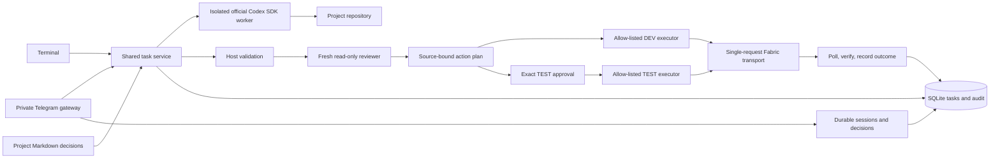

# Ray architecture

The host owns policy, credentials, state, validation and external actions. The model
receives project-scoped evidence and proposes work inside its selected repository.
It cannot approve a protected operation through model output or execute arbitrary
Fabric endpoints through a provided tool.

One OS file lock serializes each project's host work. `/stop` changes a durable
cancellation generation without waiting for that lock. SQLite atomically claims
approval/execution transitions. Plan bodies bind actor, workspace/item, operation,
configuration, repository manifest, payload and rollback snapshot. Pending plans are
cancelled on stop. Uncertain writes block new plans for that same target.

The primary thread is reused; every reviewer starts fresh. The accepted turn ID is
checkpointed before consuming model output. An unaccepted first turn is never stored
as resumable. SQLite owns task state while the official CLI stores rollouts under a
per-project Codex home. Both are necessary for full conversation restoration.

Read-only inventory is project/policy-bound before entering model context. Host
pagination ignores untrusted continuation URLs and preserves the authorized path.
The external worker uses the pinned Fabric CLI auth cache with redirects disabled,
a single HTTP call, bounded response size and no mutation retries. Operation and
job locations are validated before polling. This is local process isolation and
logical routing, not a security boundary against hostile same-user code.

Reference skills are vendored at a fixed revision with 260 file hashes and MIT
license. The router loads small relevant excerpts; it never executes vendored
scripts or installs MCP servers. An incident playbook adds evidence-first diagnosis
for incident/failure requests. The Python package is `ray_de` to avoid the unrelated
distributed-compute package named `ray`; the terminal command remains `ray`.
